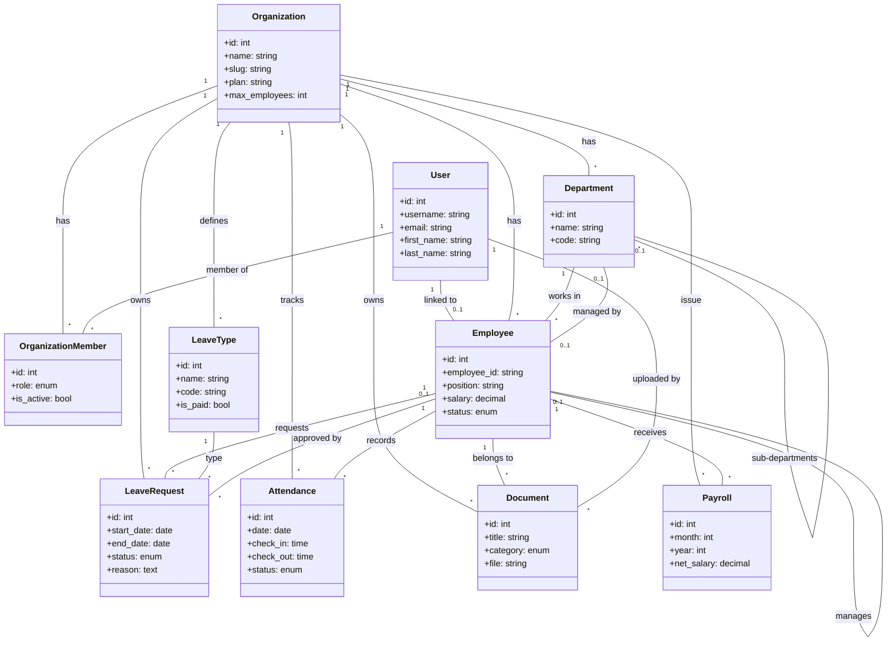

# Schéma de la Base de Données (UML)

Ce diagramme illustre l'architecture de la base de données de l'application HRMS. Le système utilise une approche **multi-tenant**, où chaque donnée est rattachée à une `Organization`.

## Points Clés de l'Architecture

1. **Multi-Tenancy** : Presque tous les modèles sont liés à `Organization` via une clé étrangère. Cela permet d'isoler les données de chaque entreprise.
2. **Double Identité** : Un utilisateur Django (`User`) est séparé de la fiche employée (`Employee`). Cela permet à une personne d'exister dans le système sans être forcément un employé (ex: un consultant externe ou un propriétaire n'ayant pas de fiche de paie).
3. **Hiérarchie** : Les employés peuvent avoir un manager (auto-relation sur `Employee`), et les départements peuvent avoir des sous-départements (auto-relation sur `Department`).
4. **Gestion des Droits** : La table `OrganizationMember` définit les droits d'accès au sein d'une organisation spécifique.
